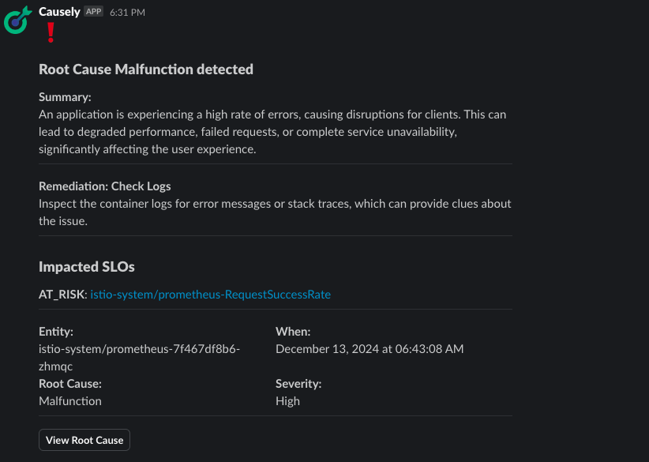

# CauselyBot

CauselyBot is a webhook service designed to receive and authenticate incoming payloads, process them, and forward the relevant information to external systems such as Slack, Teams, Jira, and OpsGenie. This server-side application validates bearer tokens included in the payload, ensuring secure communication. Once authenticated, the bot forwards the payload to specified channels using pre-configured webhook URLs, enabling streamlined notifications and updates.

## Causely Webhook endpoint configuration

To configure Causely to send notifications to CauselyBot, you need to update your `causely-values.yaml` file to include the following configuration:

```yaml
executor:
  enabled: true

notifications:
  webhook:
    url: "http://<CAUSELYBOT_FQDN/IP>:5000/webhook"    
    token: "<YOUR_CAUSELYBOT_TOKEN>"
    enabled: true
```

**Important Notes:**
- Replace `<CAUSELYBOT_FQDN/IP>` with the actual FQDN or IP address where CauselyBot is deployed
- Replace `<YOUR_CAUSELYBOT_TOKEN>` with the same token you configure in CauselyBot (see configuration section below)
- The executor must be enabled for webhook notifications to work
- CauselyBot will automatically route notifications to the appropriate external systems based on your configuration

## CauselyBot Configuration

### Example values.yaml

Here's an example `values.yaml` file for deploying CauselyBot:

```yaml
image:
  repository: us-docker.pkg.dev/public-causely/public/bot
  tag: "latest"
  pullPolicy: IfNotPresent

replicaCount: 1

auth:
  token: "<YOUR_CAUSELYBOT_TOKEN>" # Required - define your token here and then use in the Causely configuration (causely-values.yaml)

webhooks:
  - name: "slack-notifications" # Required - friendly name for this webhook
    hook_type: "slack" # Required - must be one of: slack, teams, jira, opsgenie
    filters: # Optional - configure filtering rules
      enabled: true
      values:
        - field: "severity"
          operator: "in"
          value: ["High", "Critical"]
        - field: "impactsSLO"
          operator: "equals"
          value: True
  - name: "jira-tickets"
    hook_type: "jira"
    filters:
      enabled: true
      values:
        - field: "severity"
          operator: "equals"
          value: "Critical"
  - name: "opsgenie-alerts"
    hook_type: "opsgenie"
    filters:
      enabled: false # No filtering for this webhook
```

### Configuration Details

**Valid hook_type options:**
- `slack` - Forwards notifications to Slack channels
- `teams` - Forwards notifications to Microsoft Teams channels  
- `jira` - Creates Jira tickets
- `opsgenie` - Creates OpsGenie alerts

**Environment Variables:**
For each webhook configured, you must set the following environment variables:
- `URL_<WEBHOOK_NAME>` - The webhook URL for the external service
- `TOKEN_<WEBHOOK_NAME>` - The authentication token for the external service

For example, if you have a webhook named "slack-notifications", you would set:
- `URL_SLACK_NOTIFICATIONS=https://hooks.slack.com/services/...`
- `TOKEN_SLACK_NOTIFICATIONS=xoxb-...`

**Filtering:**
You can configure filters for each webhook to control which notifications are forwarded. See the "Filtering Notifications" section below for details.

## Usage

### Clone the repository

```shell
git clone git@github.com:causely-oss/causelybot.git
cd causelybot
```

### Docker Image

CauselyBot Docker images are pre-built and published to:
```
us-docker.pkg.dev/public-causely/public/bot:latest
```

If you need to build the image locally for development or custom modifications:

```shell
docker buildx build -t us-docker.pkg.dev/public-causely/public/bot --platform linux/amd64,linux/arm64 --push .
```

### Helm Install

#### Option 1: Using values.yaml file (Recommended)

Create a `my-causelybot-values.yaml` file with your configuration:

```yaml
auth:
  token: "your-secret-token"

webhooks:
  - name: "slack-notifications"
    hook_type: "slack"
    filters:
      enabled: true
      values:
        - field: "severity"
          operator: "in"
          value: ["High", "Critical"]
        - field: "impactsSLO"
          operator: "equals"
          value: True
  - name: "jira-tickets"
    hook_type: "jira"
    filters:
      enabled: true
      values:
        - field: "severity"
          operator: "equals"
          value: "Critical"
```

Then install using the values file:

```shell
helm install bot ./helm/causelybot --namespace foo -f my-causelybot-values.yaml
```

#### Option 2: Using command line parameters

```shell
helm install bot ./helm/causelybot --namespace foo \
  --set auth.token="your-secret-token" \
  --set webhooks[0].name="slack-notifications" \
  --set webhooks[0].hook_type="slack" \
  --set webhooks[0].filters.enabled=true \
  --set webhooks[0].filters.values[0].field="severity" \
  --set webhooks[0].filters.values[0].operator="in" \
  --set webhooks[0].filters.values[0].value[0]="High" \
  --set webhooks[0].filters.values[0].value[1]="Critical"
```

**Note:** 
- The default image `us-docker.pkg.dev/public-causely/public/bot:latest` will be used automatically
- You'll also need to set the environment variables for the webhook URLs and tokens. This can be done by creating a Kubernetes secret and mounting it as environment variables, or by setting them directly in the deployment.

## Notification Payload

Below is an example of what the raw payload looks as:

```json
{
  "link": "http://causely.localhost:3000/rootCauses/81703742-b81a-43b0-8509-1e9ac718e2e3",
  "name": "Malfunction",
  "slos": [
    {
      "status": "AT_RISK",
      "slo_entity": {
        "id": "988a33f8-afea-5b3b-b7e7-a578fe5184f1",
        "link": "http://causely.localhost:3000/topology/988a33f8-afea-5b3b-b7e7-a578fe5184f1",
        "name": "istio-system/prometheus-RequestSuccessRate",
        "type": "RatioSLO"
      },
      "related_entity": {
        "id": "6abdca4f-9574-42ec-a6c4-c4ba34f11c92",
        "link": "http://causely.localhost:3000/topology/6abdca4f-9574-42ec-a6c4-c4ba34f11c92",
        "name": "istio-system/prometheus",
        "type": "KubernetesService"
      }
    }
  ],
  "type": "ProblemDetected",
  "entity": {
    "id": "030fdbc4-8d3b-58f7-aa51-259b75374174",
    "link": "http://causely.localhost:3000/topology/030fdbc4-8d3b-58f7-aa51-259b75374174",
    "name": "istio-system/prometheus-7f467df8b6-zhmqc",
    "type": "ApplicationInstance"
  },
  "labels": {
    "k8s.cluster.uid": "919a6620-4466-454f-87d9-4b877a6ddf82",
    "k8s.cluster.name": "dev",
    "k8s.namespace.name": "istio-system"
  },
  "objectId": "81703742-b81a-43b0-8509-1e9ac718e2e3",
  "severity": "High",
  "timestamp": "2024-12-13T06:43:08.309296138Z",
  "description": {
    "summary": "An application is experiencing a high rate of errors, causing disruptions for clients. This can lead to degraded performance, failed requests, or complete service unavailability, significantly affecting the user experience.",
    "remediationOptions": [
      {
        "title": "Check Logs",
        "description": "Inspect the container logs for error messages or stack traces, which can provide clues about the issue.\n"
      }
    ]
  }
}
```

Below is an example of what a problem detected notification looks like in slack:



Payload fields:

- `name`: The event name, in this case it's the problem name.
- `type`: The type of notification (e.g., "ProblemDetected").
- `entity`: The details regarding the entity for which the notification is triggered:
  - `id`: Id of the entity
  - `name`: Name of the entity
  - `type`: Type of the entity
- `description`: A description of the issue.
- `timestamp`: The timestamp when the issue was detected.
- `labels`: Metadata or tags that provide additional context (e.g., app name, Kubernetes namespace, and cluster information).
- `objectId`: A unique identifier for the specific object associated with this event, in this case it's the problem Id.
- `severity`: This is the severity of the problem detected/cleared.
- `slos`: If this field exists then it lists the impacted SLOs.

## Filtering Notifications

### Field Registery

Filtering notifications can be done based on pre-defined fields or custom defined fields in [FIELD_DEFINITIONS](causely_notification/field_registry.py). Few examples of fields definitions are shown below:

```json
{
    "severity": {"type": "direct", "path": "severity"},
    "entity.type": {"type": "direct", "path": "entity.type"},
    "impactsSLO": {"type": "computed", "func": "compute_impact_slo"},
}
```

We have defined the fields on which we want to do the filtering. There are two types of fields: `direct` and `computed`:

- Direct field means that the value of field can be parsed by following a path in nested dictionary. For example in the raw payload you have entity as the key and value is a dict containing more information and if we want to retrieve type then we provide the fully path with a dot notation as shown above.
- Computed field means that some computation must be done on the payload to get the value of that field. Refer to the the example `impactsSLO` which we use to decide if a payload consisted of any impacted SLOs and use that as a filter.

### Filter Operators

We have provided support for certain operators to do the comparison between `operand1` and `operand2` for filtering:

- `equals`: This is used to compare whether a specific field in a payload matches the given value:

```yaml
webhooks:
  - name: "slack-malfunction"
    hook_type: "slack"
    filters:
      enabled: true
      values:
        - field: "name"
          operator: "equals"
          value: "Malfunction"
```

- `in`: This is used to check whether a specific field in a payload is present in the given set:

```yaml
webhooks:
  - name: "slack-severity"
    hook_type: "slack"
    filters:
      enabled: true
      values:
        - field: "severity"
          operator: "in"
          value: ["High", "Critical"]
```

We also support the inverse-operations like `not_equals` and `not_in` as well. You can also provide multiple filters for a webhook like:

```yaml
webhooks:
  - name: "slack-malfunction-slo"
    hook_type: "slack"
    filters:
      enabled: true
      values:
        - field: "name"
          operator: "equals"
          value: "Malfunction"
        - field: "impactsSLO"
          operator: "equals"
          value: True
```

## Multiple Webhooks

We also support providing multiple webhooks each with their own sets of filters:

```yaml
webhooks:
  - name: "slack-malfunction-slo"
    hook_type: "slack"
    filters:
      enabled: true
      values:
        - field: "name"
          operator: "equals"
          value: "Malfunction"
        - field: "impactsSLO"
          operator: "equals"
          value: True
  - name: "jira-critical-tickets"
    hook_type: "jira"
    filters:
      enabled: true
      values:
        - field: "severity"
          operator: "in"
          value: ["High", "Critical"]
- name: "teams-all-notifications"
    hook_type: "teams"
    filters:
      enabled: false # No filtering - receives all notifications
```

**Remember:** For each webhook, you must set the corresponding environment variables:
- `URL_SLACK_MALFUNCTION_SLO` and `TOKEN_SLACK_MALFUNCTION_SLO`
- `URL_JIRA_CRITICAL_TICKETS` and `TOKEN_JIRA_CRITICAL_TICKETS`
- `URL_TEAMS_ALL_NOTIFICATIONS` and `TOKEN_TEAMS_ALL_NOTIFICATIONS`
